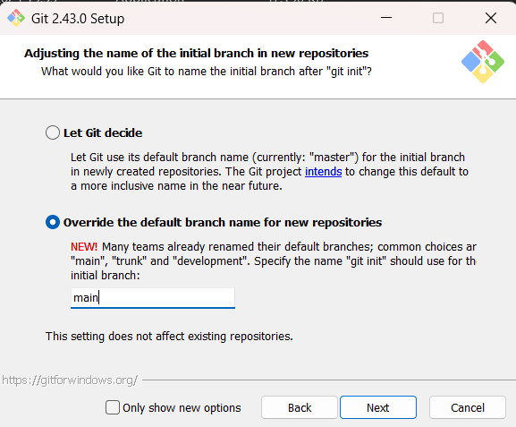

# Open Source Task

Welcome to the **Open Source Task**! 👋  
This guide will help you understand the basics of **Git** and **GitHub**, helping you get started with version control and open-source collaboration.  

---

## 🧠 **What is Git?**  
Git is the most commonly used version control system. It tracks changes made to files, allowing you to maintain a history of updates and revert to previous versions if needed. Git makes collaboration easier by enabling multiple people to work on the same project and merge their changes seamlessly.

### 📥 **How to Install Git**  
1. Go to [https://git-scm.com/downloads](https://git-scm.com/downloads) and download Git for your computer.  
2. During installation, you’ll see an option to select the **default branch name** (as shown below):  
   - ✅ **Select "Override the default branch name for new repositories."**  
   - ✅ Type **"main"** in the box. 

      
3. Click **Next** and complete the installation.  

---

## 🌐 **What is GitHub?**  
GitHub is a cloud-based Git repository hosting service. It allows individuals and teams to manage and share their code, collaborate on projects, and keep track of version history.

---

## 🎯 **How to Get Started**  
To get familiar with Git and GitHub, you can refer to this YouTube playlist:  
➡️ [Git & GitHub Playlist](https://youtube.com/playlist?list=PLRAV69dS1uWT4v4iK1h6qejyhGObFH9_o&si=zdRyuxQ5n_bK8pw2)  

---

## 🚀 **Your First Task**  
Navigate to the **[Task](./Task/README.md)** folder to find detailed instructions for completing your first open-source task.  

---

Happy coding! 😎  
