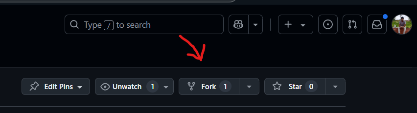
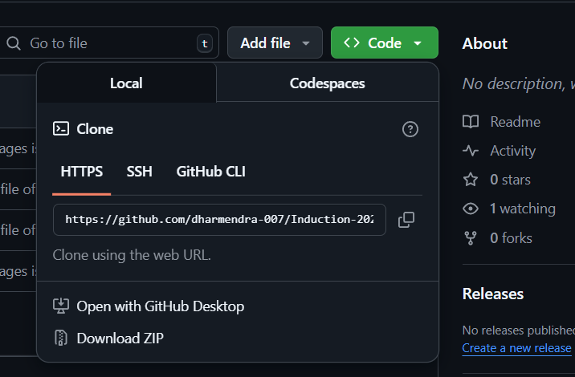

# 🌟 **Task**

## 🚀 **Getting Started**

### **Task Overview**
In this task, you'll learn the basics of **Git**, **GitHub**, and **README files** — essential skills for every developer! 🚀

### **📖 What is a README file?**
A README.md file is a markdown file that provides important information about a project. It typically includes an introduction, setup instructions, usage guidelines, and other relevant details. In open-source projects, it helps contributors understand the purpose and structure of the repository. Markdown syntax allows for easy formatting, making README files readable and visually appealing. 🚀

## 💻 **Task Steps**

### **1. Repository Forking**
1. Visit [https://github.com/EnigmaVSSUT/Induction-2025](https://github.com/EnigmaVSSUT/Induction-2025)
2. Click on the **Fork** button at the top right corner
3. This creates a copy of the repository in your GitHub account

<div align="center">
  
</div>

### **2. Clone the Repository**
1. Go to your forked repository
2. Click on **Clone** and copy the repo address
3. Open Git Bash in your desired folder
4. Run the command:
   ```bash
   git clone <your_repo_address>
   ```

<div align="center">
  
</div>

### **3. Create Your Profile File**
1. Navigate to `Open_Source/Task` directory
2. Create a new folder with your name (e.g., `Dharmendra_Mahanta/`)  
3. Inside this folder, create a file named `README.md`  
4. Add the following details inside `README.md` in Markdown format:
   - Name
   - Registration Number
   - Branch
   - Domain (e.g., Web Development, AI/ML)
   - Hobbies

For reference, see the file [Dharmendra_Mahanta/README.md](./Dharmendra_Mahanta/README.md) in the Task folder.

You can make it as fancy as you like!

### **4. Stage Your Changes**
```bash
git add .
```

### **5. Commit Your Changes**
```bash
git commit -m "Completed Open Source Task"
```

### **6. Push to GitHub**
```bash
git push origin main
```

### **7. Create a Pull Request**
1. Go to the **Pull Requests** tab on GitHub
2. Click **"New Pull Request"**
3. Click **"Create Pull Request"**

<div align="center">
  
</div>

## 📋 **Requirements**
- Create a **README file** containing the details
- Meaningful commit
- Successful pull request

## 💬 **Need Help?**
Ask questions in the [**Open Source**](https://discord.com/channels/1352736519265456182/1355113053602975864) channel on our **Discord** server!

## ⏳ **Important Dates**
**Deadline:** 1st April – 3rd April 2025

## 🎉 **Final Notes**
- Double-check your file before submitting
- Follow the example file in the repository
- Have fun learning Git and GitHub!

**Happy Coding! 🚀**