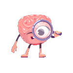

>### "Success is not final, failure is not fatal: It is the courage to continue that counts."  
> — Winston Churchill  

# [**Enigma - The Web and Coding Club**](https://enigmavssut.in/)  

## 🚀 **Welcome to Induction 2025**  
We’re thrilled to welcome all freshers to **Enigma Induction 2025**! Get ready for an exciting learning journey as you explore new technologies and sharpen your coding skills. This is your chance to grow and become part of something bigger.  

At **Enigma**, we value **knowledge transfer** above all. That’s why our induction process is designed to help you learn and apply your skills effectively.  

---

## 🏆 **Induction Process**  
Inductions are not just tests — they are about learning, improving, and showcasing your potential. The process includes **three stages**:

### 1. **Knowledge Transfer** 🔃  
We will be conducting a Bootcamp on **Git & GitHub** and **C++** to strengthen your foundational skills and introduce you to essential tools and concepts.  

### 2. **Assessment** 🏹  
Complete and submit the tasks provided during this process. Your submissions will be evaluated to measure your progress.  
- **All tasks will have their own guidelines** to ensure clarity and consistency.  
- **Each task will have its own deadline** to keep the process structured and on track.  

### 3. **Personal Interview** 👨‍⚖️  
Candidates who perform well in the tasks will advance to a personal interview round.  

---

## 📅 **Schedule Overview**  
The induction process will run for **Two weeks** starting from **31st March 2025**. Here's the breakdown:  
---

### ✅ **Week 1 (1st April - 3rd April) | Open Source**   
Kick off your journey by mastering the basics of **Git & GitHub**. All necessary resources will be provided.  
- [👉 Task: Git Basics](./Open_Source/README.md)

---

### 🌐 **Week 2 (3rd - 9th April) | Domain Wise Task**   
Explore the world of **Web Development**, **App Development**, and **AI/ML** by diving into foundational concepts and hands-on tasks. 

#### 🚀 **Web Development**  
Learn the basics of **HTML**, **CSS** to create responsive web pages.  
- [👉 Task: Comming Soon]()  
---
#### 📱 **App Development**  
Explore **Kotlin** to build native Android apps.  
- [👉 Task: Coming Soon]()

---

#### 🤖 **AI/ML**  
Understand the basics of **Python** and explore the domain of AI/ML.  
- [👉 Task: Comming Soon]()  

---

### 🏅 **Contest (6th April) | Competitive Programming**   
Put your problem-solving skills to the test with an exciting competitive coding challenge.  
- [👉 Task: Coming Soon]()  

---

## 📌 **Submission Guidelines**  
- Submit your tasks by pushing to **GitHub** and creating a **pull request**.  
- Tasks without a pull request will **NOT** be considered.  
- Regular evaluations will be conducted based on your progress.  

---

## 👨‍💼 **Personal Interview**  
- Personal Interviews will begin from **12th April**.  

---

## 🔗 **Let's Connect**  
Want to learn more about the club and stay updated? Check us out here:  
- 🌐 **Website:** [https://enigmavssut.in](https://enigmavssut.in)  
- 📸 **Instagram:** [@enigma_vssut](https://www.instagram.com/enigma_vssut)  
- 💼 **LinkedIn:** [linkedin.com/company/enigma-vssut](https://www.linkedin.com/company/enigma-vssut)  

Stay connected and be a part of the community!

  
---

🎯 **Ready to make your mark? Let’s begin this journey together!**  

**— Team Enigma 💚**  
